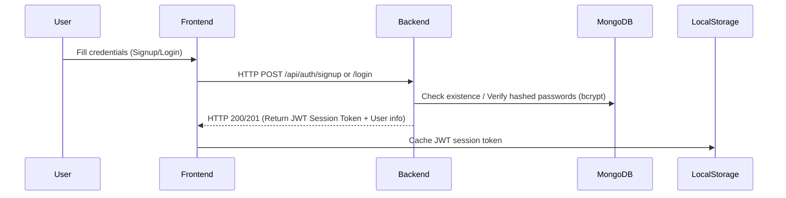
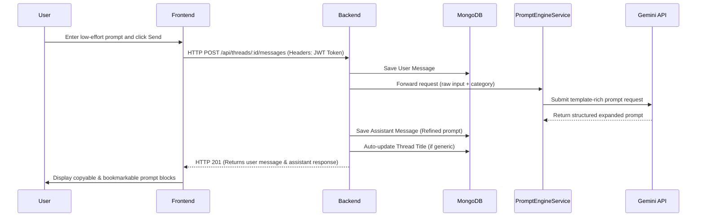

# Promptly - AI Prompt Engineering Workspace

Promptly is a developer-centric prompt expansion and refinement utility. It is designed to take vaguer, low-effort user prompts (e.g. `"make a cyberpunk dashboard UI"`) and expand them into structured, high-fidelity prompt templates optimized for AI assistants (like ChatGPT, Claude, Midjourney, v0, etc.). 

This repository is structured as a MERN stack (MongoDB, Express, React, Node.js) monorepo.

---

## 📂 Repository Directory Structure

```
PromptMaker/
├── README.md                 # Root-level Project Handbook (This file)
├── .gitignore                # Root-level gitignore to prevent credentials leakage
├── backend/                  # Node.js + Express backend service
│   ├── .env.example          # Template for backend configurations
│   ├── .gitignore            # Excludes local node_modules, logs and env files
│   ├── vercel.json           # Vercel Serverless Function routing configuration
│   ├── server.js             # Main server entrypoint (Vercel-compatible)
│   ├── package.json          # Node dependencies & script runners
│   ├── models/               # Mongoose Schemas (User, Thread, Message, SavedPrompt)
│   ├── routes/               # API Router Handlers (auth, threads, prompts)
│   ├── middleware/           # Express middlewards (jwt authorization guard)
│   └── services/             # Core business logic services
│       └── PromptEngineService.js # LLM / Gemini API prompt conversion engine
└── frontend/                 # Vite + React + TailwindCSS client application
    ├── .env.example          # Template for frontend environment configurations
    ├── .gitignore            # Excludes build assets, local envs and logs
    ├── index.html            # SPA entrypoint
    ├── package.json          # Frontend dependencies & Vite command runners
    └── src/
        ├── App.jsx           # App shell with React Router and Auth Guards
        ├── main.jsx          # Client DOM mountpoint
        ├── index.css         # Styling system configuration
        ├── pages/            # View Pages (Login, Signup, Dashboard)
        └── context/          # State Context Providers (AuthContext.jsx)
```

---

## ⚙️ Core Technical Workflows & Data Flows

### 1. Authentication Flow


* **Passwords** are securely hashed using `bcryptjs` on the backend inside a pre-save hook of the `User` mongoose model.
* **Authentication** is state-maintained in the frontend via a `useAuth` Hook/Context that checks the user status and passes the JSON Web Token (JWT) in the `Authorization: Bearer <token>` header of every api call.

### 2. Thread Creation & Lazy Persistence
To prevent empty or unused sessions from cluttering the history panels, Promptly uses a deferred creation flow:
1. **Local State Init**: Clicking **`+ New Thread`** resets the active workspace and sets a temporary `_id: "new"` thread object in the frontend's local state. **No network request is made at this stage.**
2. **First Message Send**: When the user posts a prompt parameter, the system checks if the active thread is unsaved. If yes, it creates the thread record on the backend (`POST /api/threads`), updates the local threads listing, and makes it the active thread.
3. **Content auto-titling**: The backend auto-renames the generic thread title `"New Thread"` to a 30-character snippet of the first prompt message once saved.

### 3. Prompt Refinement Flow


---

## 🛠️ Local Development (Zero-to-Hero Guide)

### Prerequisites
* [Node.js](https://nodejs.org/) (v18+)
* [MongoDB](https://www.mongodb.com/try/download/community) running locally (port `27017`) or a remote MongoDB Atlas connection URI.

### Step 1: Configure Environment Variables
You must create `.env` files inside both directories. They are ignored by Git.

**For Backend (`backend/.env`):**
```env
PORT=5000
MONGO_URI=mongodb://localhost:27017/promptly
JWT_SECRET=your_jwt_secret_key
GEMINI_API_KEY=your_gemini_api_key_from_google_ai_studio
```

**For Frontend (`frontend/.env`):**
```env
VITE_API_URL=http://localhost:5000
```

### Step 2: Install Dependencies & Run

1. **Start MongoDB** on your local machine.
2. **Backend**:
   ```bash
   cd backend
   npm install
   npm run dev      # Runs server with watcher on port 5000
   ```
3. **Frontend**:
   ```bash
   cd ../frontend
   npm install
   npm run dev      # Runs Vite dev server on port 5173
   ```
4. Open `http://localhost:5173` in your browser.

---

## 🚀 Production Deployment (Vercel)

Both the frontend and the backend are configured for simple, independent, or monorepo deployment on **Vercel**.

### Deploying the Backend
1. Link the backend folder to Vercel (or set `backend/` as the root directory of your Vercel project).
2. Vercel will auto-detect the `vercel.json` routing configuration and build it as a serverless function.
3. Configure the following **Environment Variables** in the Vercel project dashboard:
   - `MONGO_URI` (Your MongoDB Atlas connection URI)
   - `JWT_SECRET` (A strong random string)
   - `GEMINI_API_KEY` (Your Google AI Studio API key)
   - `NODE_ENV` = `production`

### Deploying the Frontend
1. Link the frontend folder to Vercel (or set `frontend/` as the root directory of your Vercel project).
2. Set the framework preset to **Vite**.
3. Configure the following **Environment Variable** in the Vercel project dashboard:
   - `VITE_API_URL` = `https://your-backend-vercel-url.vercel.app`
4. Deploy the project!
